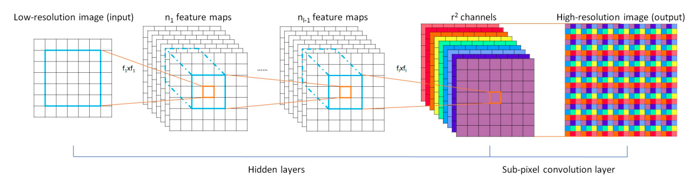
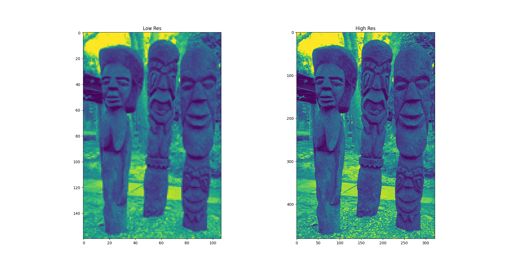
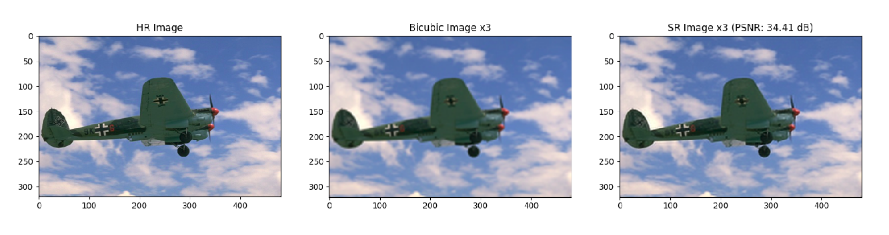

# ESPCN

This repository is implementation of the ["Real-Time Single Image and Video Super-Resolution Using an Efficient Sub-Pixel Convolutional Neural Network"](https://arxiv.org/abs/1609.05158).

<center></center>

## Requirements

- PyTorch 1.0.0
- Numpy 1.15.4
- Pillow 5.4.1
- h5py 2.8.0
- tqdm 4.30.0
- OpenCV

## Train

The 91-image, Set5 dataset converted to HDF5 can be downloaded from the links below.

| Dataset | Scale | Type | Link |
|---------|-------|------|------|
| 91-image | 3 | Train | [Download](https://www.dropbox.com/s/4mv1v4qfjo17zg3/91-image_x3.h5?dl=0) |
| Set5 | 3 | Eval | [Download](https://www.dropbox.com/s/9qlb94in1iqh6nf/Set5_x3.h5?dl=0) |


<table>
    <tr>
    	<td>
    		<center></center>
    	</td>
    </tr>
</table>


```bash
python main.py --model train/inferance              
```

The results are stored in the same path as the query image.
## Results
PSNR was calculated on the Y channel.
### Set5

| Eval. Mat | Scale | Paper (91) | Ours (91) |
|-----------|-------|-------|-----------------|
| PSNR | 3 | 32.55 | 32.88 |

<table>
    <tr>
    	<td>
    		<center></center>
    	</td>
    </tr>
</table>
